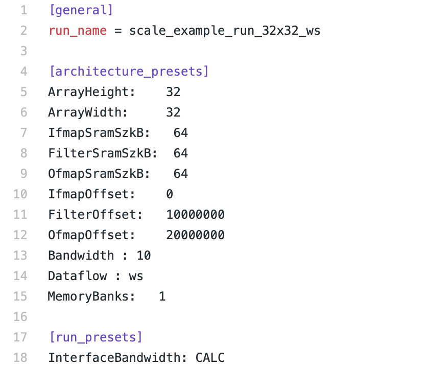

.. _config:

SCALE-Sim v2 Config file
========================

The configuration file is used to specify the architecture and run parameters for the simulations.
The following shows a sample config file:

The config file has three sections. The "**general**" section specifies the run name, which is user specific. The "**architecture_presets**" section describes the parameter of the systolic array hardware to simulate.
The "**run_preset**" section specifies if the simulator should run with user specified bandwidth, or should it calculate the optimal bandwidth for stall free execution.