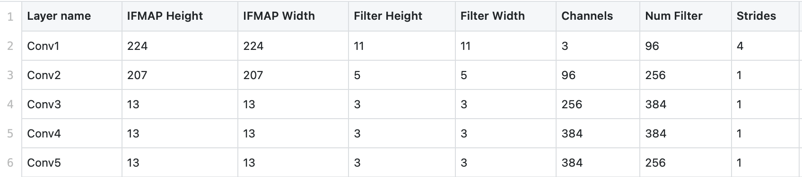
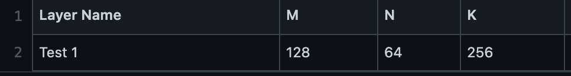

.. _topology:

SCALE-Sim v2 topology files
===========================

The topology file is a *CSV* file which decribes the layers of the workload topology. The layers are typically described as convolution layer parameters as shown in the example below.

For other layer types, SCALE-Sim also accepts the workload desciption in M, N, K format of the equivalent GEMM operation as shown in the example below.

The tool however expects the inputs to be in the convolution format by default. When using the mnk format for input, please specify using the  ``-i gemm`` switch, as shown in the example below.

``$ python3 <scale sim repo root>/scalesim/scale.py -c <path_to_config_file> -t <path_to_mnk_topology_file> -i gemm``