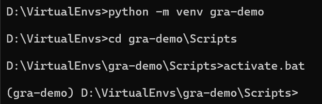
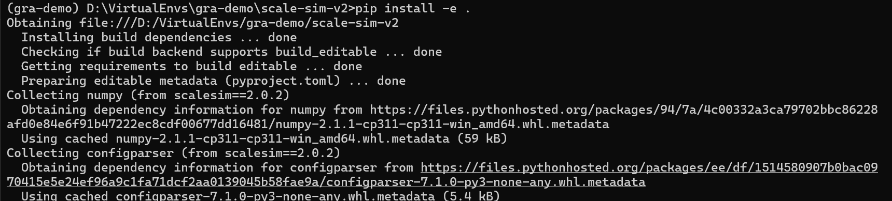

# Systolic CNN AcceLErator Simulator (SCALE Sim) v2

Find the details related to Vanilla SCALE-Sim at the link below:
[Vanilla SCALE-Sim Details](https://github.com/scalesim-project/scale-sim-v2)


## Setup
1. Create a virtual environment and activate it using the following commands:
    ```
    python -m venv <virtual-environment-name>
    ```
    ```
    cd <virtual-environment-name>\Scripts
    ```
    ```
    activate.bat
    ```

    


2. Clone the ```scale-sim-v2``` folder from [SparseSim](https://github.gatech.edu/HML8803-Spring24/Team9_Sparsity_SCALE_Sim) git repository in ```..\<virtual-environment-name>\``` path. [Clone the repository elsewhere, and copy the ```scale-sim-v2``` folder inside the ```..\<virtual-environment-name>\``` path.]

3. Install ScaleSim using the following command:
    ```
    pip install -e \path_to_scalesim_cloned_folder\
    ```
    In this case, \path_to_scalesim_cloned_folder\ will be ```..\<virtual-environment-name>\scale-sim-v2```

    

## Using SparseSim
1. Modify the ```run_name``` if required in the ```system.cfg``` file.

2. We have provided two topology files, one for general matrix multiplication operation (GEMM) and another for convolution operation (CONV).


    1. ```conv_mix.csv``` : The command to run CONV topology file is 
        ```
        python scalesim/scale.py -c sparsesim/system.cfg -t sparsesim/conv_mix.csv -p sparsesim/hml_conv_results
        ```

    2. ```gemm_mix.csv``` : The command to run GEMM topology file is 
        ```
        python scalesim/scale.py -c sparsesim/system.cfg -t sparsesim/gemm_mix.csv -p sparsesim/hml_gemm_results -i gemm
        ```

    The corresponding sparsity information related to the layers in this topology file are found in ```/sparsesim/layers/```

3. Along with existing reports, ```SPARSE_REPORT.csv``` is generated, which will compare the storage after sparsity is enabled.

## Modifications done to the original ScaleSim repository

1. ```compression.py``` - This python file takes care of calculating 
    1. the storage occupied by various compression formats.
    2. the latency required to convert from any compression format to blocked ELLPACK.
2. ```operand_matrix.py``` - Operand matrix has been modified to support sparse matrices.
3. ```systolic_compute_ws.py``` - Demand matrix has been modified to support sparse matrices. Mapping efficiency calculation has been modified too.
4. ```double_buffered_scratchpad_mem_sparsity.py``` - Created a spearate scratchpad memory file to handle sparsity requirements.
5. ```scale_config.py``` - Monitors sparsity related knobs (sparsity support, sparse representation, sparse accelerator).
6. ```simulator.py``` - Sparse report generation is handled in this file.
7. ```single_layer_sim.py``` - ```single_layer_sim``` class is modified to support sparsity functionality (while simulating a single layer of the model) such as reading filter metadata, maintaining old and new filter storage sizes, report parameters, etc.
8. ```topology_utils.py``` - reads the ```layer_name.txt``` files containing the sparsity information.
9. ```sparsesim``` folder - contains topology files, config file and ```layer_name.txt``` files (containing sparsity information).
